# Distributed HDBSCAN & DBSCAN with Apache Spark

## Abstract

This project studies how density-based clustering algorithms can be implemented and analyzed in a distributed Spark environment. We implemented a distributed DBSCAN baseline and an approximate distributed HDBSCAN-inspired clustering pipeline from scratch using PySpark. The implementation does not call Spark MLlib or any black-box clustering training API. Instead, it manually implements spatial partitioning, ghost point replication, local density-based clustering, Union-Find merging, mutual reachability graph construction, Kruskal minimum spanning tree construction, and a simplified hierarchy condensation and stability-based cluster extraction procedure.

The project has two main goals. From the machine learning perspective, it demonstrates the limitation of traditional DBSCAN on variable-density data and shows why HDBSCAN-style hierarchical density clustering is more suitable for complex density structures. From the distributed systems perspective, it explores how the globally dependent graph computation inside HDBSCAN can be transformed into a Spark/MapReduce-style multi-stage pipeline. The key optimization is local MST compression: each partition first compresses its local mutual reachability graph into a local MST, and only the compressed local edges together with cross-boundary edges are collected to the driver for global merging. This avoids directly constructing a full global $O(N^2)$ mutual reachability graph.

The experimental evaluation contains four parts: algorithm correctness and superiority on synthetic variable-density data, strong scaling with different numbers of cores, data scalability with increasing dataset size, and a real-world case study on NYC Yellow Taxi pickup locations. The results show that DBSCAN is highly sensitive to the global `eps` parameter, while the HDBSCAN-inspired implementation preserves variable-density structures better on the synthetic dataset. The strong scaling experiment shows that the local graph construction phase benefits from parallelism, but the driver-side global MST merge is limited by Amdahl's Law. The data scalability experiment shows that the system avoids the direct explosion of a naive complete graph, although cross-boundary candidate edges and driver-side merging remain important bottlenecks. The real-world taxi experiment further illustrates DBSCAN's parameter sensitivity and exposes the limitations of the current approximate HDBSCAN-inspired implementation on disconnected spatial components.

## 1. Problem Description

Clustering is a fundamental task in data mining and machine learning. It aims to discover hidden structure in unlabeled data by grouping similar data points together. Density-based clustering is especially useful for spatial data, trajectory mining, and anomaly detection because it does not require clusters to be spherical and does not require the number of clusters to be specified in advance.

DBSCAN is one of the most classic density-based clustering algorithms. It has three important advantages: it does not require the number of clusters as input, it can discover clusters of arbitrary shape, and it can explicitly identify noise points. DBSCAN is controlled mainly by two parameters: `eps` and `min_samples`. A point is a core point if it has at least `min_samples` neighbors within radius `eps`. Clusters are formed by expanding from core points through density reachability, while points that cannot be absorbed into any cluster are labeled as noise.

However, the main weakness of DBSCAN also comes from `eps`. DBSCAN uses a single global distance threshold to define density everywhere. This creates a fundamental conflict on variable-density data. If `eps` is too small, sparse clusters are incorrectly labeled as noise. If `eps` is too large, nearby dense regions may be incorrectly merged. This issue is even more obvious in real-world geographic data such as NYC taxi pickup locations, where airports, Manhattan, transit hubs, bridges, and residential areas can have very different local densities.

HDBSCAN addresses this problem by avoiding a single global `eps`. It uses core distance, mutual reachability distance, minimum spanning trees, and a condensed hierarchy to select stable clusters across density levels. In principle, HDBSCAN is more suitable for datasets containing multiple density regimes. However, standard HDBSCAN is computationally expensive. It requires global nearest-neighbor information, a mutual reachability graph, an MST, and hierarchical cluster extraction. If the full graph over $N$ points is constructed directly, the number of edges is $N(N-1)/2$, which quickly becomes infeasible in both memory and runtime.

Therefore, the main problem of this project is: how can we manually implement an interpretable and scalable distributed density clustering system in Spark, while preserving the core ideas of DBSCAN and HDBSCAN and exposing meaningful MapReduce-style distributed computation?

## 2. Algorithm Description

### 2.1 DBSCAN Baseline

The standard DBSCAN procedure can be summarized as follows:

```text
Input: dataset D, distance threshold eps, density threshold min_samples
Output: cluster label for each point

for each unvisited point p in D:
    mark p as visited
    neighbors = all points within eps of p
    if |neighbors| < min_samples:
        mark p as noise
    else:
        create a new cluster C
        expand C by repeatedly visiting density-reachable neighbors
```

On a single machine, the main bottlenecks are neighborhood search and cluster expansion. A naive implementation needs to compare each point with all other points, which leads to nearly $O(N^2)$ time complexity. In a distributed environment, the difficulty is even higher because a point's neighbors may lie in another partition. If each partition runs DBSCAN independently, a real cluster crossing a partition boundary may be split into several local clusters. Thus, distributed DBSCAN must solve both local computation and cross-partition merging.

The distributed DBSCAN implementation in this project uses a three-stage design:

1. Grid partitioning: divide the space into grid cells.
2. Ghost points: replicate a point to adjacent cells if it is within `eps` of a cell boundary.
3. Local DBSCAN and Union-Find merging: run a manually implemented DBSCAN inside each partition, then merge local clusters on the driver using Union-Find based on shared replicated points.

This DBSCAN baseline provides an interpretable comparison point for the HDBSCAN-inspired algorithm and highlights the limitations of using a fixed global `eps`.

### 2.2 Core Ideas of HDBSCAN

HDBSCAN can be understood as a hierarchical extension of DBSCAN. Its key concepts are:

Core distance: for each point $x$, the core distance is the distance from $x$ to its $k$-th nearest neighbor, where $k$ corresponds to `min_samples`.

Mutual reachability distance:

$$
MRD(a,b)=\max(core\_dist(a), core\_dist(b), dist(a,b))
$$

This distance makes points in sparse regions appear farther away, which helps separate regions of different density in the hierarchy.

MST on the MRD graph: HDBSCAN can be viewed as constructing a minimum spanning tree over the complete mutual reachability graph. A single linkage hierarchy is then obtained by cutting long edges.

Condensed tree and stability extraction: HDBSCAN does not select a fixed distance threshold. Instead, it evaluates how long a cluster persists across density levels. Clusters with higher stability are selected, while short-lived or small structures are treated as noise or replaced by more stable parent or child clusters.

### 2.3 Distributed HDBSCAN-Inspired Pipeline

A fully exact industrial-grade distributed HDBSCAN is difficult to implement because global KNN, the global MRD graph, and distributed MST construction are all complex problems. This project implements an approximate distributed HDBSCAN-inspired pipeline. The goal is not to exactly reproduce an industrial HDBSCAN library, but to map the most important graph computation ideas of HDBSCAN into a Spark pipeline.

The pipeline has four phases:

```text
Input: RDD[(point_id, coordinates)], min_samples, min_cluster_size, max_dist
Output: RDD[(point_id, cluster_label)]

Phase 1: KD-tree spatial partitioning
    sample data on Driver
    build KD-tree-like partition bounds
    assign each point to its primary partition
    replicate points near other partitions as ghost points

Phase 2: Local graph construction
    group points by partition
    compute local distance matrix
    compute local core distances
    compute mutual reachability distances
    build Local MST for primary-primary edges
    retain primary-ghost boundary edges

Phase 3: Global MST merging
    collect local MST edges and boundary edges to Driver
    run Kruskal to build Global MST

Phase 4: Tree condensation and cluster extraction
    build simplified single linkage hierarchy
    condense tree and compute stability
    extract selected clusters
    broadcast labels back to workers
```

The key idea is local MST compression. In standard HDBSCAN, the MRD graph is theoretically complete. Sending all edges to the driver would be infeasible. This project first constructs a local MST inside each partition, reducing primary-primary candidate edges from $O(M^2)$ to approximately $O(M)$. Cross-partition connectivity is represented by primary-ghost boundary edges. In this way, expensive distance matrix and local graph computation are pushed down to the workers, while the driver only merges a compressed set of candidate edges.

## 3. Spark Implementation Details

### 3.1 Project Structure

The main modules are:

```text
core/
  distance.py       # Distance computation and local distance matrix
  graph.py          # Union-Find and Kruskal MST
  partitioning.py   # GridPartitioner and KDTreePartitioner
  spark_utils.py    # Spark initialization and timing utilities

dbscan/
  local_dbscan.py   # Local DBSCAN
  distributed.py    # Distributed DBSCAN scheduler

hdbscan/
  local_graph.py    # Local core distance / MRD / Local MST
  distributed.py    # Distributed HDBSCAN-inspired pipeline
  tree_hierarchy.py # Simplified tree condensation and cluster extraction

scripts/
  generate_data.py
  run_experiment.py
  plot_experiment2.py
  plot_experiment3.py
  visualize.py
  visualize_taxi_spark.py
```

The main entry point is `scripts/run_experiment.py`. It reads a CSV file and converts it into an RDD:

```text
(point_id, np.array([x, y]))
```

The model output is:

```text
(point_id, cluster_label)
```

The final labels are merged back into the original CSV and saved under the `data/` directory.

### 3.2 Distributed DBSCAN Implementation

The DBSCAN implementation uses `GridPartitioner`. If `cell_size` is not specified, the system uses `2 * eps` by default. Each point is first assigned to its primary grid cell. If it is within `eps` of a cell boundary, it is replicated to adjacent cells as a ghost point. Ghost points allow local DBSCAN to see boundary neighbors and prevent clusters from being broken simply because of partition boundaries.

Inside each partition, `LocalDBSCAN` is executed. It uses `scipy.spatial.distance.pdist` and `squareform` to compute a local distance matrix, then performs cluster expansion using a manually implemented BFS. To preserve locality, ghost points may join a cluster, but they do not actively trigger unlimited expansion across partitions.

After local clustering, the driver collects local cluster assignments. If the same original point appears in multiple partitions and belongs to non-noise local clusters, those local clusters should be merged. The system uses a manually implemented Union-Find data structure to merge local clusters and assign final global cluster IDs.

### 3.3 Distributed HDBSCAN Phase 1: KD-Tree Spatial Partitioning

The HDBSCAN-inspired pipeline uses KD-tree-style spatial partitioning. The system samples up to about 10,000 points from the RDD on the driver. It then recursively splits the space by median values along alternating dimensions to construct rectangular partition bounds. Compared with a simple grid, KD-tree partitioning is more suitable for uneven data distributions because it adapts to sampled data density and helps reduce partition skew.

Since HDBSCAN does not have a fixed `eps`, boundary replication cannot directly use an `eps` radius. This project introduces `max_dist` as a soft boundary range. If a point does not belong to a partition as a primary point but is within `max_dist` of that partition's rectangular boundary, it is replicated as a ghost point. This is an engineering trade-off: if `max_dist` is too small, cross-partition connections may be missed; if it is too large, ghost points and boundary edges can grow quickly.

### 3.4 Phase 2: Local MRD Graph and Local MST

After each partition receives its primary and ghost points, it constructs a local graph:

1. Build a local pairwise distance matrix using vectorized distance computation.
2. Compute local core distance for each point using the `min_samples`-th nearest neighbor.
3. Compute mutual reachability weights using $MRD(a,b)=\max(core\_dist(a), core\_dist(b), dist(a,b))$.
4. Classify edges into three types:
   - primary-primary edges: used to construct the local graph and Local MST.
   - primary-ghost edges: retained as cross-boundary candidate edges.
   - ghost-ghost edges: discarded, since their primary partitions are responsible for them.
5. Output Local MST edges and cross-boundary edges.

This phase is the most important parallel stage in the system. Local distance matrices and Local MSTs are computed independently across partitions, which fits Spark worker parallelism well. Local MST compression reduces the number of primary-primary edges that need to be sent back to the driver.

### 3.5 Phase 3: Driver-Side Global MST Merging

Phase 3 collects all candidate edges from Phase 2 to the driver and runs Kruskal's algorithm to build the Global MST. This is a reasonable engineering choice for a course project because Local MST compression already reduces the local primary-primary graph before global merging. The driver no longer handles the full $O(N^2)$ MRD graph.

However, this phase is also a natural bottleneck. Since Kruskal is executed on the driver, it does not significantly benefit from increasing Spark local cores. In the strong scaling experiment, Phase 3 time remains almost unchanged as the number of cores increases, and sometimes even increases slightly due to scheduling and candidate edge variation. This is a direct example of Amdahl's Law: the overall speedup of a distributed system is limited by its sequential part.

### 3.6 Phase 4: Tree Condensation and Label Assignment

After the Global MST is built, the system performs a simplified HDBSCAN hierarchy extraction on the driver. It first simulates single linkage merging by processing MST edges in ascending weight order and building a hierarchy. Then it condenses the tree from top to bottom, checks whether splits produce valid clusters using `min_cluster_size`, computes cluster stability, and selects final clusters.

This module is manually implemented and does not call an HDBSCAN library or high-level scipy hierarchy interface. It demonstrates the core idea of HDBSCAN, but it should be interpreted carefully. The current `TreeHierarchy` mainly assumes a single global MST root. If the candidate graph is actually a forest with multiple disconnected components, some components may not be properly included in hierarchy condensation and label propagation. This limitation appears clearly in the NYC taxi 10,000-point experiment.

### 3.7 Spark-Level Optimizations and Timing

Several Spark-level techniques are used:

- Use `flatMap` to generate primary points and ghost points.
- Use `groupByKey` to collect points belonging to the same partition before local graph construction.
- Use NumPy/SciPy vectorized distance matrices instead of Python nested loops.
- Use manually implemented Union-Find and Kruskal instead of high-level ML libraries.
- Use `persist()` on important RDDs.
- Use `count()` to force Spark actions and break lazy evaluation, making phase-level `@timeit` measurements closer to actual execution time.
- Configure local cores, driver/executor memory, and Kryo serializer during Spark initialization.

## 4. Experimental Evaluation

The experiments are designed around two questions. First, from the algorithmic perspective, is the HDBSCAN-inspired method more suitable than DBSCAN for variable-density data? Second, from the system perspective, does the Spark pipeline show interpretable scalability as the number of cores and dataset size increase?

### 4.1 Experiment 1: Algorithm Correctness on Synthetic Variable-Density Data

The synthetic dataset is generated by `scripts/generate_data.py`. It contains four types of structures: moon-shaped clusters, sparse Gaussian blobs, an extremely dense small blob, and random background noise. This dataset intentionally combines different densities and non-convex shapes to test DBSCAN's sensitivity to `eps`.

The experimental figures are:

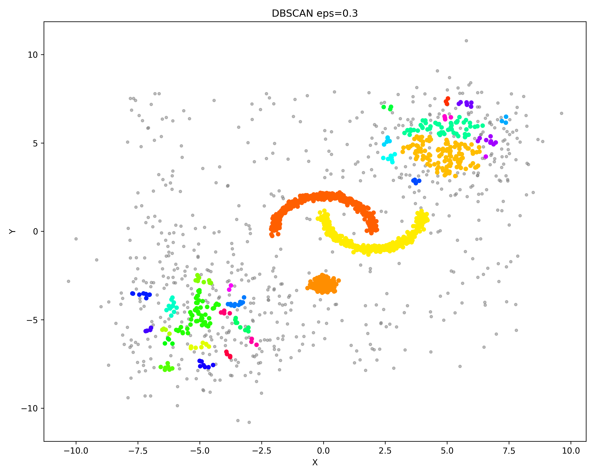

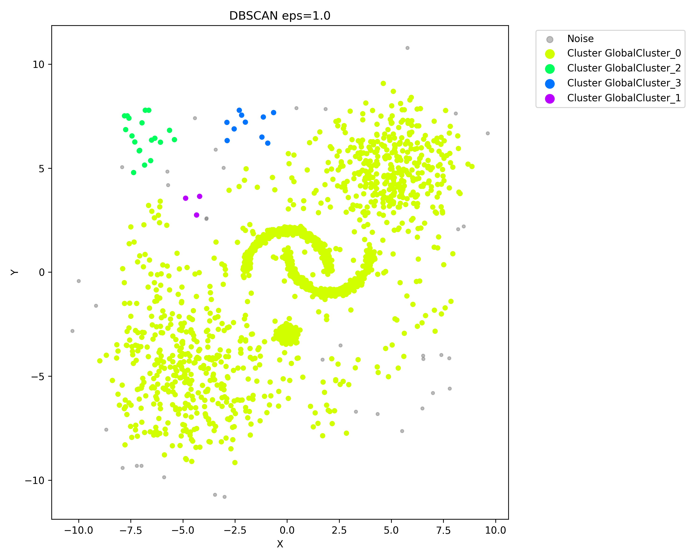

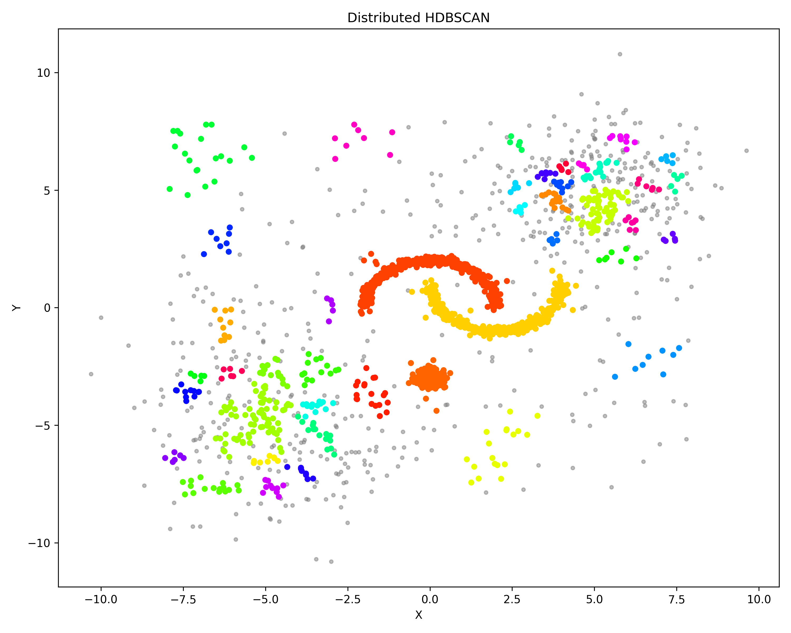

According to `data/test_data_2k_dbscan_results_eps0.3.csv`, DBSCAN with `eps=0.3` produces 31 clusters and 626 noise points, so the noise ratio is 31.3%. The figure shows that a small `eps` preserves the two moon-shaped structures and some dense blobs, but many sparse regions, especially the upper-right area, are fragmented into small clusters or labeled as gray noise. This means a small radius works for dense structures but fails to cover sparse clusters.

When `eps=1.0`, DBSCAN produces only 4 clusters and the number of noise points drops to 37, or 1.8%. However, this is not a better clustering result. The largest cluster contains 1,931 points, or 96.5% of the dataset. In the figure, most of the moons, sparse blobs, dense blob, and connecting background points are merged into one huge `GlobalCluster_0`. This is the typical failure mode of DBSCAN on variable-density data: increasing `eps` to include sparse clusters also causes different clusters to be over-merged.

The HDBSCAN-inspired result produces 42 clusters and 482 noise points, giving a noise ratio of 24.1%. The two moon-shaped structures remain visible, and the dense blob is also identified. At the same time, sparse regions are not discarded as aggressively as in `eps=0.3`, nor are they merged into one giant cluster as in `eps=1.0`. The result is still somewhat fragmented, which reflects the approximate nature of the implementation. Nevertheless, structurally it better balances dense and sparse regions than fixed-`eps` DBSCAN.

The conclusion of Experiment 1 is that DBSCAN is highly sensitive to the choice of `eps`. A small `eps` makes sparse clusters become noise, while a large `eps` causes over-merging. The HDBSCAN-inspired method reduces the dependence on a single global distance threshold and better preserves variable-density structures in the synthetic dataset.

### 4.2 Experiment 2: Strong Scaling with Number of Cores

The strong scaling experiment fixes the dataset as `test_data_10k.csv` and changes Spark local cores among 1, 2, and 4. We measure total runtime and phase-level runtime. The experiment was recorded on both Intel Core i7 and Apple M1.

Figures:

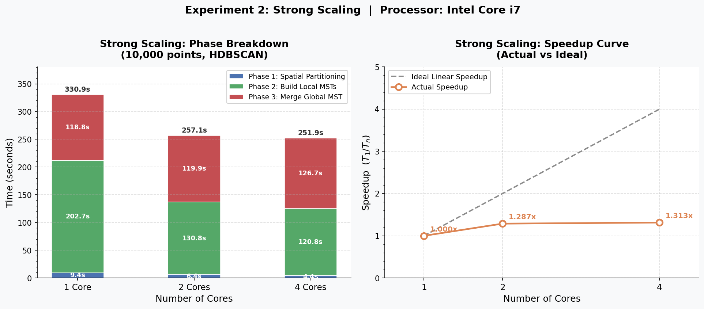

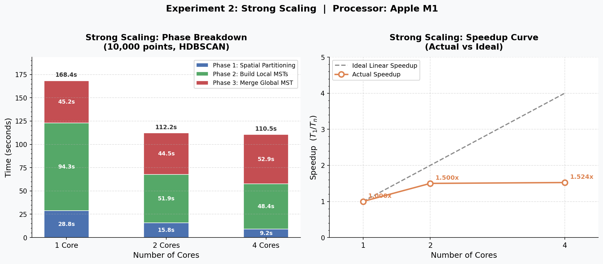

The Intel Core i7 results are:

| Cores | Phase 1 Spatial Partitioning | Phase 2 Local MST | Phase 3 Global MST | Total | Speedup |
|---:|---:|---:|---:|---:|---:|
| 1 | 9.4157s | 202.6561s | 118.8170s | 330.8888s | 1.000x |
| 2 | 6.3747s | 130.7947s | 119.9011s | 257.0705s | 1.287x |
| 4 | 4.4397s | 120.7852s | 126.7119s | 251.9368s | 1.313x |

The Apple M1 results are:

| Cores | Phase 1 Spatial Partitioning | Phase 2 Local MST | Phase 3 Global MST | Total | Speedup |
|---:|---:|---:|---:|---:|---:|
| 1 | 28.8406s | 94.2808s | 45.2292s | 168.3506s | 1.000x |
| 2 | 15.7653s | 51.9486s | 44.4981s | 112.2120s | 1.500x |
| 4 | 9.2194s | 48.3827s | 52.8582s | 110.4603s | 1.524x |

Both hardware platforms show the same general trend. Increasing from 1 core to 2 cores significantly reduces total runtime, while increasing from 2 cores to 4 cores gives much smaller improvement. On i7, total runtime decreases from 330.89s to 257.07s and then to 251.94s. On M1, total runtime decreases from 168.35s to 112.21s and then to 110.46s. The actual speedup is far below ideal linear speedup: with 4 cores, i7 reaches only 1.313x and M1 reaches 1.524x.

The phase breakdown explains why. Phase 2 is the local graph construction and Local MST stage, which is the most parallelizable part of the system. On i7, Phase 2 decreases from 202.66s to 130.79s and then to 120.79s. On M1, it decreases from 94.28s to 51.95s and then to 48.38s. More cores do reduce local computation time, but the marginal improvement from 2 to 4 cores is limited. Possible reasons include Spark local-mode scheduling overhead, Python worker overhead, memory bandwidth limits, and insufficient partition granularity.

Phase 3 behaves very differently. On i7, Phase 3 changes from 118.82s to 119.90s and then to 126.71s. On M1, it changes from 45.23s to 44.50s and then to 52.86s. It does not decrease with more cores because candidate edges are collected to the driver and Kruskal is executed sequentially on the driver.

This result is a clear example of Amdahl's Law. The parallelizable Phase 2 benefits from additional cores, but the sequential Phase 3 limits the overall speedup. As the number of cores increases, Phase 3 becomes a larger fraction of total runtime and becomes the dominant scalability bottleneck.

### 4.3 Experiment 3: Data Scalability

The data scalability experiment fixes the number of cores at 4 and uses synthetic datasets with sizes 1k, 2k, 5k, and 10k. We measure total runtime, phase runtime, and edge counts.

Figures:

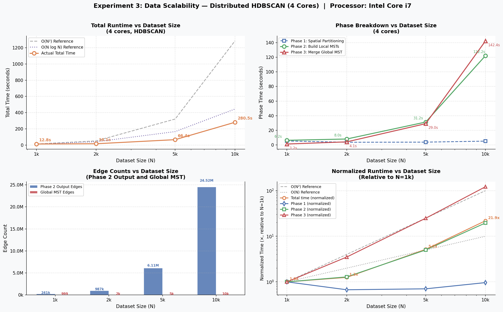

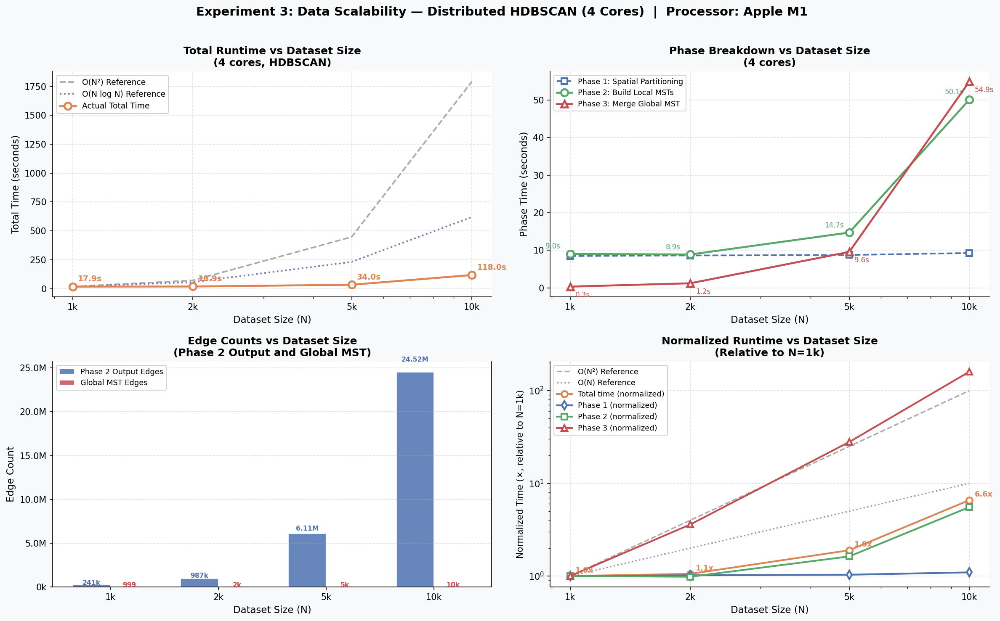

The Intel Core i7 timing results are:

| N | Phase 1 | Phase 2 | Phase 3 | Total |
|---:|---:|---:|---:|---:|
| 1,000 | 5.3051s | 6.2394s | 1.1684s | 12.8308s |
| 2,000 | 3.5601s | 8.0128s | 4.0899s | 16.0686s |
| 5,000 | 3.7330s | 31.2422s | 29.0258s | 66.3525s |
| 10,000 | 5.1078s | 122.2111s | 142.3687s | 280.5226s |

The Apple M1 timing results are:

| N | Phase 1 | Phase 2 | Phase 3 | Total |
|---:|---:|---:|---:|---:|
| 1,000 | 8.4817s | 9.0491s | 0.3433s | 17.9190s |
| 2,000 | 8.6358s | 8.8961s | 1.2368s | 18.9187s |
| 5,000 | 8.7653s | 14.7318s | 9.5790s | 33.9932s |
| 10,000 | 9.2916s | 50.1126s | 54.9087s | 118.0327s |

As the dataset grows from 1k to 10k, total runtime on i7 increases from 12.83s to 280.52s, about 21.86x. On M1, total runtime increases from 17.92s to 118.03s, about 6.59x. The growth is not linear, but the system remains runnable and avoids directly constructing a naive complete graph. For 10k points, a complete graph would contain:

$$
\frac{10000 \times 9999}{2}=49,995,000
$$

edges. Directly constructing and sorting this full MRD graph on the driver would be expensive in both memory and runtime. The implemented pipeline avoids this direct approach by performing local graph construction and Local MST compression before global merging.

The edge count statistics are:

| N | Phase 2 Output Candidate Edges | Global MST Edges |
|---:|---:|---:|
| 1,000 | 241,346 | 999 |
| 2,000 | 986,906 | 1,999 |
| 5,000 | 6,109,519 | 4,999 |
| 10,000 | 24,516,479 | 9,999 |

These numbers need careful interpretation. `Global MST Edges` is always $N-1$, which confirms that the final global tree structure is linear in the number of points. However, `Phase 2 Output Candidate Edges` still grows quickly and reaches 24.52M at 10k points. These candidate edges include not only local MST edges, but also primary-ghost cross-boundary edges. Since HDBSCAN does not have a fixed `eps`, this implementation uses `max_dist` as the soft boundary range. If `max_dist` covers many boundary points, cross-boundary edges can grow substantially. Thus, Local MST compression effectively controls primary-primary edges within each partition, but boundary edges remain an important scalability cost.

The phase timing supports this interpretation. On i7, Phase 2 grows from 6.24s to 122.21s, about 19.59x, while Phase 3 grows from 1.17s to 142.37s, about 121.86x. On M1, Phase 2 grows from 9.05s to 50.11s, about 5.54x, while Phase 3 grows much more sharply from 0.34s to 54.91s. As the dataset grows, the driver must sort and merge a rapidly increasing number of candidate edges, so Phase 3 changes from a lightweight step at small scale into one of the main bottlenecks.

Therefore, Experiment 3 has two conclusions. First, the system does avoid direct global complete-graph construction and can run HDBSCAN-inspired clustering at the 10k scale in local Spark mode. Second, cross-boundary candidate edges and driver-side Kruskal merging are the main remaining scalability limitations. This is a more realistic result than simply claiming linear scaling: after one bottleneck is optimized, the next bottleneck becomes visible at larger scale.

### 4.4 Experiment 4: NYC Yellow Taxi Real-World Data

The real-world dataset uses NYC Yellow Taxi pickup coordinates. We test two subsets: 2,000 points and 10,000 points. Unlike the synthetic dataset, this data uses longitude and latitude coordinates and has highly uneven spatial density. Manhattan, airports, transit hubs, and other areas have very different pickup densities. Therefore, the purpose of this experiment is not to find one uniquely correct clustering, but to observe how different algorithms and parameters interpret real spatial distributions.

The 2,000-point result is:

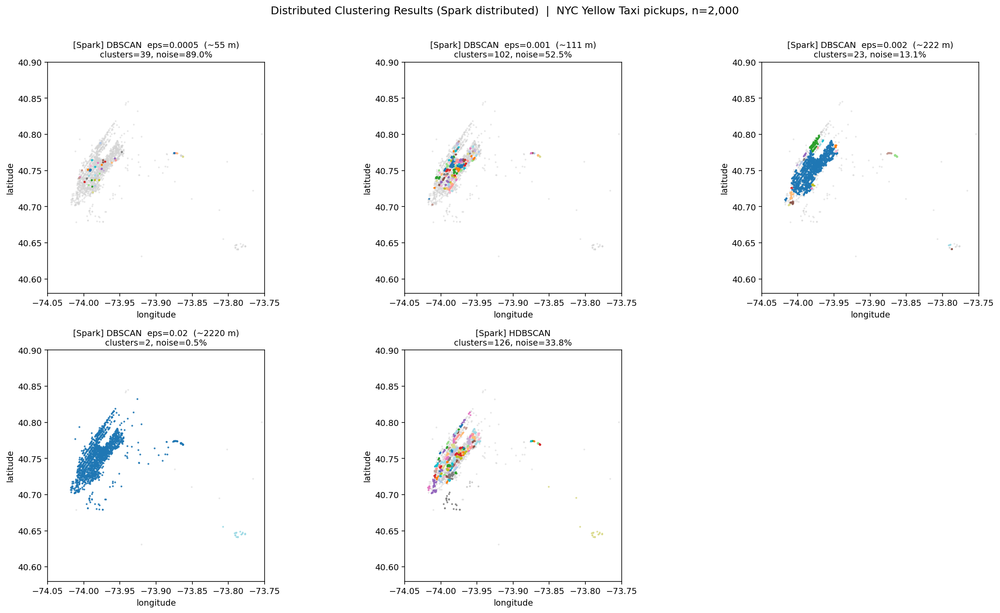

The 10,000-point result is:

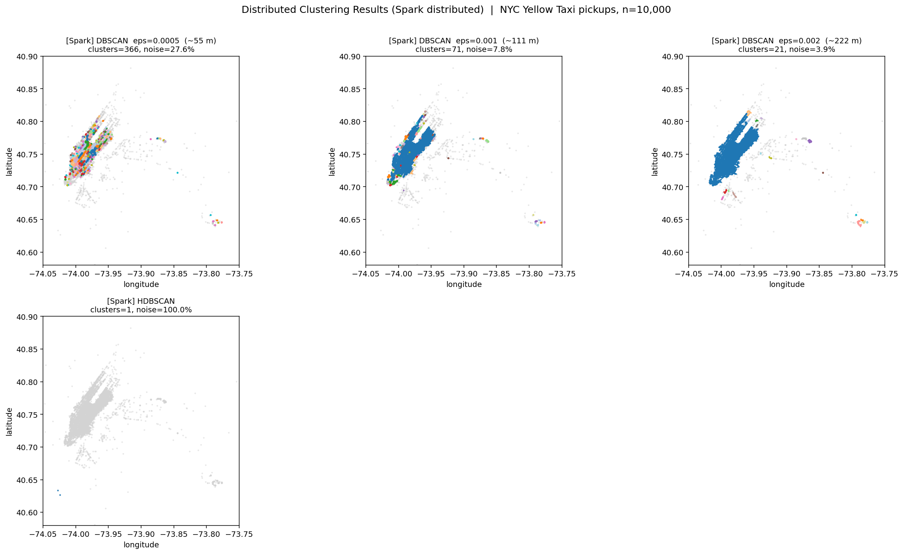

The map-based visualizations are:

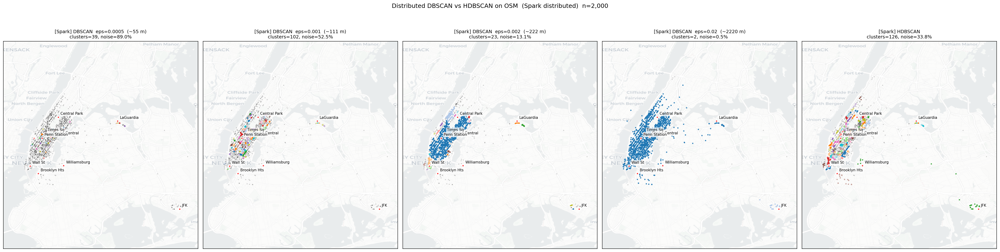

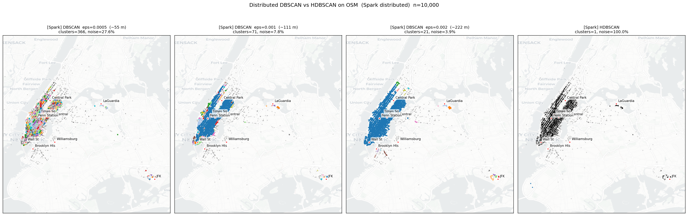

#### 4.4.1 Taxi 2000 Results

The statistics for Taxi 2000 are:

| Method | Clusters | Noise | Noise Ratio | Largest Cluster |
|---|---:|---:|---:|---:|
| DBSCAN eps=0.0005 | 39 | 1780 | 89.0% | 21 |
| DBSCAN eps=0.001 | 102 | 1051 | 52.5% | 51 |
| DBSCAN eps=0.002 | 23 | 261 | 13.1% | 1469 |
| DBSCAN eps=0.02 | 2 | 11 | 0.5% | 1966 |
| HDBSCAN-inspired | 126 | 676 | 33.8% | 42 |

In the sweep figure, `eps=0.0005` corresponds to about 55 meters. This radius is too small, and most points are labeled as noise. Only a few highly local clusters remain. This shows that in real city data, even points belonging to the same functional area may be more than 55 meters apart.

When `eps=0.001`, or about 111 meters, the noise ratio decreases to 52.5% and the number of clusters increases to 102. The Manhattan region begins to show many colored clusters, but many gray noise points remain. This setting captures local street-level structures better than 55 meters, but the result is still fragmented.

When `eps=0.002`, or about 222 meters, the noise ratio further decreases to 13.1%, but the largest cluster contains 1,469 points, or 73.5% of the dataset. In the figure, a large part of Manhattan is dominated by one cluster. This indicates that DBSCAN starts to connect adjacent neighborhoods through density chains. It reduces noise but sacrifices geographic specificity.

`eps=0.02`, or about 2.2 kilometers, is intentionally too large. Almost all points are merged into one huge cluster: the largest cluster has 1,966 points, or 98.3% of the dataset. This clearly demonstrates DBSCAN's over-merging problem. When the radius reaches the urban-neighborhood scale, dense regions become connected into one giant component, and the clustering result loses practical geographic meaning.

The HDBSCAN-inspired method produces 126 clusters, 33.8% noise, and a largest cluster of only 42 points. It does not merge the Manhattan region into one huge cluster like `eps=0.002` or `eps=0.02`. Instead, it preserves many smaller local structures. This shows that the HDBSCAN-inspired method reduces the over-merging caused by a single radius. However, it also produces many small clusters, which suggests that the current approximate hierarchy extraction is still somewhat fragmented on real geographic data.

#### 4.4.2 Taxi 10000 Results

The statistics for Taxi 10000 are:

| Method | Clusters | Noise | Noise Ratio | Largest Cluster |
|---|---:|---:|---:|---:|
| DBSCAN eps=0.0005 | 366 | 2756 | 27.6% | 314 |
| DBSCAN eps=0.001 | 71 | 780 | 7.8% | 7906 |
| DBSCAN eps=0.002 | 21 | 389 | 3.9% | 9215 |
| HDBSCAN-inspired | 1 | 9998 | 100.0% | 2 |

The 10,000-point result amplifies DBSCAN's parameter sensitivity. With `eps=0.0005`, the method produces 366 clusters and 27.6% noise. Since the sample is denser, a 55-meter radius can already form many local clusters in Manhattan, but many points remain gray noise.

With `eps=0.001`, the noise ratio drops to 7.8%, but the largest cluster contains 7,906 points, or 79.1% of all points. The figure shows that a large part of Manhattan is already connected into one major cluster. With `eps=0.002`, this effect becomes stronger: the largest cluster contains 9,215 points, or 92.2%, and the number of clusters drops to 21. This means that as sample density increases, the same `eps` is more likely to connect dense regions into giant clusters through density chains. DBSCAN is sensitive not only to `eps`, but also to sample density.

The HDBSCAN-inspired method on Taxi 10000 produces a near-all-noise result: 9,998 points are labeled as `NOISE`, and only 2 points form one cluster. This should not be interpreted as a failure of the HDBSCAN theory itself. Instead, it exposes limitations of the current approximate distributed implementation.

According to the code structure, the current HDBSCAN-inspired pipeline relies on `max_dist` to generate ghost points and cross-boundary edges. It also assumes that the candidate graph produced in Phase 3 can support a reasonably complete single-root hierarchy. However, the real taxi dataset is highly uneven and multi-centered in geographic space. The candidate graph may not form a single connected MST. It may instead become a forest with multiple disconnected components. The current `TreeHierarchy` mainly handles a single-root tree. If the input is actually a forest, some connected components may not participate correctly in tree condensation and label propagation. Those points then receive no valid cluster label and are finally mapped to `NOISE` in `_assign_labels`.

In addition, the 10,000-point version does not include the `eps=0.02` DBSCAN run. The reason is that `eps=0.02` is approximately 2.2 kilometers in longitude/latitude scale. In dense areas such as Manhattan, this radius creates an extremely dense neighborhood graph. The current DBSCAN implementation constructs local distance matrices and performs Python-level BFS expansion inside partitions. When `eps` is too large, neighborhood relationships can approach $O(M^2)$ within a partition, causing long runtime and high memory pressure. The 2,000-point experiment already demonstrates the over-merging effect of `eps=0.02`, so omitting it for 10,000 points is a reasonable experimental choice.

## 5. Discussion and Limitations

### 5.1 Algorithmic Complexity and Parallelization Value

The implemented system is more complex than a simple DBSCAN baseline. It includes not only distributed spatial partitioning and local clustering, but also core distance, mutual reachability distance, MST construction, single linkage hierarchy, and stability-based cluster extraction. More importantly, these components are implemented manually rather than delegated to an existing HDBSCAN library.

The main parallelization novelty is Local MST compression. The hard part of HDBSCAN is the large global MRD graph. This project pushes graph computation down to partitions: each partition computes local distances and MRD weights, compresses primary-primary edges through a Local MST, and sends only compressed edges plus boundary edges to the driver. This reflects the push-down computation idea in MapReduce: keep heavy computation local to workers and reduce the amount of data that must be shuffled or collected.

Experiment 2 shows that Phase 2 benefits from multiple cores, and Experiment 3 shows that the system can run from 1k to 10k points instead of being blocked immediately by a global complete graph. This demonstrates that the parallelization design is effective.

### 5.2 Driver Bottleneck and Amdahl's Law

The most obvious bottleneck is Phase 3. In the strong scaling experiment, Phase 3 does not decrease as the number of cores increases. In the data scalability experiment, Phase 3 grows rapidly with the number of candidate edges and becomes one of the main costs at 10k points.

This means driver-side Kruskal is a clear sequential bottleneck. At the course project scale, this design has two advantages: it is simple to explain and it runs at the 10k scale. However, from a scalability perspective, it limits the system's ability to process much larger datasets. Further scaling would require a distributed global MST algorithm, such as a Boruvka-style graph algorithm, or stronger multi-level candidate edge compression before global merging.

### 5.3 Trade-Off of `max_dist` and Boundary Edges

HDBSCAN does not have DBSCAN's `eps`, so distributed boundary replication requires an additional parameter. This project uses `max_dist` to control ghost point replication. This parameter is an engineering trade-off:

- If `max_dist` is too small, cross-partition connections may be missed, and the candidate graph may become a forest.
- If `max_dist` is too large, ghost points and primary-ghost boundary edges may grow rapidly, increasing both Phase 2 output size and Phase 3 merge cost.

The edge counts in Experiment 3 already show this issue. Although the final Global MST has only $N-1$ edges, Phase 2 output candidate edges reach 24.52M at 10k points. This shows that boundary edges are a major scalability cost in the current implementation.

### 5.4 Positioning as an Approximate HDBSCAN-Inspired Implementation

The HDBSCAN part of this project should be described as an approximate distributed HDBSCAN-inspired implementation, not a fully exact industrial HDBSCAN implementation. The main simplifications are:

1. Core distance is computed using partition-local primary and ghost points instead of exact global KNN.
2. The MRD graph is not the full global complete graph; it is approximated by Local MST edges and cross-boundary edges.
3. Global MST construction assumes that the candidate graph is sufficiently connected, while real data may produce a forest.
4. Tree condensation is a simplified manual implementation and does not fully handle all edge cases such as multiple connected components, repeated distances, and complex label propagation.

This positioning does not reduce the contribution of the project. Instead, it makes the experimental analysis more credible. The project demonstrates how the core ideas of HDBSCAN can be mapped into a Spark/MapReduce pipeline, rather than claiming to replace a mature industrial library.

### 5.5 Issues Revealed by Real Data

The near-all-noise result on Taxi 10000 must be explained honestly. It shows that the current implementation is not robust enough for highly uneven, multi-centered real-world geographic data when the candidate graph becomes disconnected. This result is useful because it demonstrates deeper system understanding: a distributed algorithm report should not only show successful plots, but also explain when and why the system fails.

For this project, the failure mainly comes from engineering approximation and hierarchy implementation assumptions, not from the HDBSCAN theory itself. If each connected component were processed separately during hierarchy extraction, or if global candidate graph connectivity were improved, the real-data HDBSCAN-inspired result could likely be improved. This is discussed here as a limitation rather than as a separate future work section.

## 6. Conclusion

This project implemented a distributed density-based clustering system from scratch in PySpark, including a Distributed DBSCAN baseline and a Distributed HDBSCAN-inspired pipeline. The DBSCAN part uses grid partitioning, ghost points, local DBSCAN, and Union-Find merging. The HDBSCAN-inspired part further implements KD-tree partitioning, local core distance, mutual reachability distance, Local MST compression, Global MST merging, and simplified tree condensation.

From the algorithmic experiments, DBSCAN shows strong sensitivity to `eps` on synthetic variable-density data. A small `eps` turns sparse regions into noise, while a large `eps` merges multiple structures into a giant cluster. The HDBSCAN-inspired method is not a full industrial HDBSCAN implementation, but it better preserves variable-density structures and reduces dependence on a single global distance threshold.

From the system experiments, Phase 2 local graph construction benefits from more cores, which confirms the value of pushing computation down to partitions. However, Phase 3 driver-side Global MST merging does not speed up with more cores, demonstrating the sequential bottleneck predicted by Amdahl's Law. The data scalability experiment further shows that Local MST and Global MST reduce the final tree structure to $O(N)$, but cross-boundary candidate edges remain a key scalability limitation.

From the real-world experiment, NYC taxi data clearly shows DBSCAN's parameter sensitivity in geographic clustering and exposes the limitations of the current approximate HDBSCAN-inspired implementation on disconnected spatial components. Overall, this project implements a working distributed clustering system and provides a detailed experimental analysis of the trade-offs among parallelism, communication cost, driver bottlenecks, boundary replication, and algorithmic approximation.

## 7. Source Code

The source code is submitted as separate files. The main files are:

```text
core/distance.py
core/graph.py
core/partitioning.py
core/spark_utils.py
dbscan/local_dbscan.py
dbscan/distributed.py
hdbscan/local_graph.py
hdbscan/distributed.py
hdbscan/tree_hierarchy.py
scripts/generate_data.py
scripts/run_experiment.py
scripts/plot_experiment2.py
scripts/plot_experiment3.py
scripts/visualize.py
scripts/visualize_taxi_spark.py
```

The report focuses on the main algorithmic ideas and experimental results. The complete implementation is provided in the source files listed above.

## 8. References

1. Ester, M., Kriegel, H. P., Sander, J., & Xu, X. (1996). A density-based algorithm for discovering clusters in large spatial databases with noise. Proceedings of KDD.
2. Campello, R. J. G. B., Moulavi, D., & Sander, J. (2013). Density-Based Clustering Based on Hierarchical Density Estimates. PAKDD.
3. McInnes, L., Healy, J., & Astels, S. (2017). hdbscan: Hierarchical density based clustering. Journal of Open Source Software.
4. Apache Spark Documentation: RDD Programming Guide and PySpark API.
5. Kruskal, J. B. (1956). On the shortest spanning subtree of a graph and the traveling salesman problem. Proceedings of the American Mathematical Society.
6. NYC Taxi & Limousine Commission Trip Record Data.
